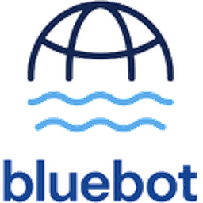
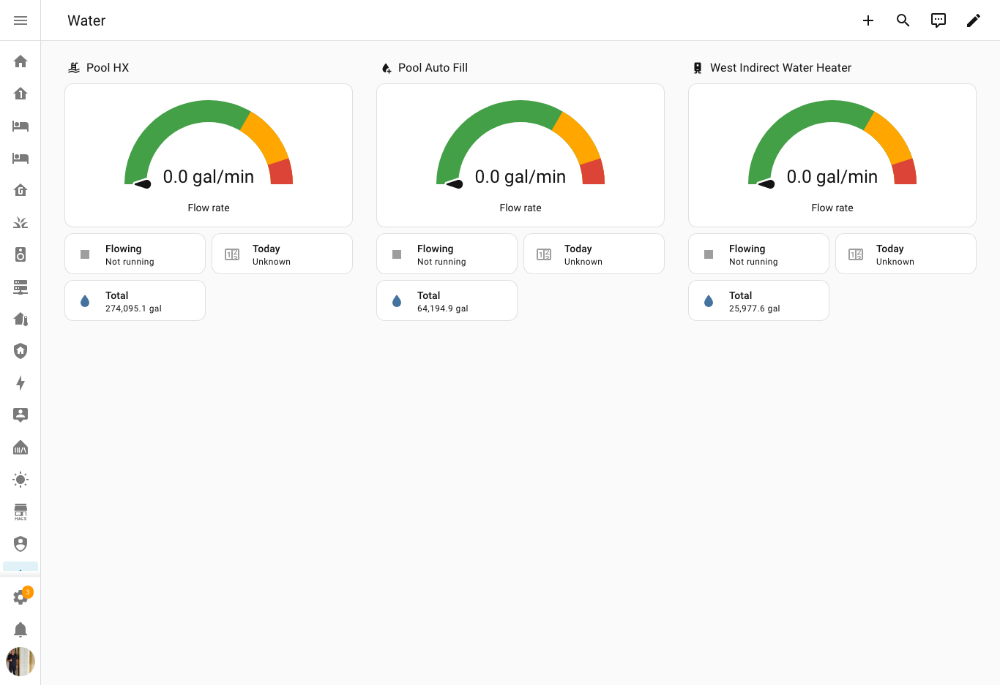

<p align="center">
  
</p>

# Bluebot Water Meter — Home Assistant integration

A custom [Home Assistant](https://www.home-assistant.io/) integration for
[**Bluebot**](https://www.bluebot.com/) ultrasonic water-flow meters. It polls
the Bluebot cloud API and exposes each meter as a Home Assistant device with
real-time flow, cumulative volume (for the Energy/Water dashboard), and signal
diagnostics.

> Cloud polling. Your meters must be online and reporting to Bluebot's cloud
> (FloDash). This integration is read-only — it never changes anything on your
> account.

## Use cases

- **Real-time flow monitoring & alerts** — e.g. alert when a heat-exchanger or
  boiler loop *should* be circulating but flow is zero (or vice-versa).
- **Daily usage tracking** — let Home Assistant's statistics derive gallons/day,
  e.g. for a pool auto-fill or irrigation line.
- **Total consumption** — feed the cumulative volume into the HA water dashboard.

## Entities

Each meter exposes:

| Entity | Type | Description |
|---|---|---|
| Flow rate | `sensor` | Real-time flow in gallons/minute. Reads `0` when the meter has been idle (no recent datapoint); `unavailable` if the cloud poll fails. |
| Total volume | `sensor` (`total_increasing`) | Lifetime cumulative gallons — usable in the Energy/Water dashboard; HA derives daily/weekly/monthly. |
| Today | `sensor` | Gallons used since local midnight — the meter's own daily rollup (Bluebot `resolution=day` in the meter's timezone). Populates immediately, resets at local midnight, survives restarts (no `utility_meter` helper needed). |
| Flowing | `binary_sensor` (`running`) | On while water is actively moving. |
| Signal quality | `sensor` (diagnostic) | Datapoint quality %. |
| Signal strength | `sensor` (diagnostic, disabled by default) | Radio signal %. |
| Network RSSI | `sensor` (diagnostic, disabled by default) | Network RSSI in dBm. |
| Last datapoint | `sensor` (diagnostic) | Timestamp of the most recent reading. |

Units are US gallons / gallons-per-minute, as reported by the Bluebot API.

## Installation (HACS)

1. In HACS → ⋮ → **Custom repositories**, add
   `https://github.com/salanki/hass-bluebot` with category **Integration**.
2. Install **Bluebot Water Meter** and restart Home Assistant.
3. **Settings → Devices & Services → Add Integration → Bluebot Water Meter**.

## Configuration

Enter a **Bluebot API key** (generate one in FloDash → Settings → API keys).

> **Note on the key format:** Bluebot keys look like `prefix.uuid`. Only the
> part *after the dot* is accepted by the API — this integration normalizes the
> key automatically, so you can paste either the full key or just the UUID.

The integration discovers all active meters on the account automatically. To
pick up newly-added meters, reload the integration.

### Options

- **Flow poll interval** (default 30 s) — how often real-time flow is fetched
  (one request covers all meters).
- **Total volume poll interval** (default 5 min) — how often cumulative totals
  are refreshed.

## Example dashboard

A ready-to-use, generic example is in [`examples/dashboard.yaml`](examples/dashboard.yaml):
one card per meter — flow gauge, flowing indicator, Today, total volume, and a
per-day usage bar graph (`statistics-graph`, `change` per day) for that meter.



> The daily-usage graph builds up from long-term statistics once the sensors have
> been recording (HA compiles these hourly), so it fills in over the first day.

## How it works

- A fast coordinator polls `GET /flow/latest` once per cycle for all meters
  (real-time flow). A slower coordinator polls `GET /flow/datapoints/{id}?resolution=total`
  per meter for the cumulative volume.
- Bluebot meters only emit datapoints **while water flows**, so a stale latest
  datapoint means "idle" — the flow sensor then reads `0`, while a failed poll
  marks entities `unavailable` instead.

## Data update & limitations

- Real-time flow latency is the flow poll interval (default 30 s). The Bluebot
  cloud MQTT stream is not used yet (its public docs were unavailable at the time
  of writing); REST polling is the supported path.
- The cloud API's rate limits are undocumented; the defaults are intentionally
  conservative.

## Troubleshooting

- **`invalid_auth` / reauth prompt:** the API key was rejected — generate a new
  key in FloDash and re-enter it.
- **No meters appear:** confirm the meters are *active/installed* in FloDash and
  reporting data.
- Download **diagnostics** from the device page (secrets are redacted) when
  filing an issue.

## Development

```sh
make check      # ruff + pytest (Docker)
make test-live  # opt-in read-only test against the real API (needs BLUEBOT_API_KEY)
```

## License

MIT © Peter Salanki. Not affiliated with Bluebot.
